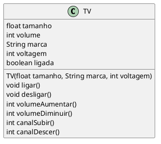

```java

class Programa {
    void main() {
        TV tv1 = new TV(55, "Samsung", 220);
        TV tv2 = new TV(42, "LG", 110);
        TV tv3 = new TV(65, "Sony", 220);

        tv1.ligar();
        tv2.ligar();
        tv3.ligar();

        tv1.volumeAumentar();
        tv2.volumeDiminuir();
        tv3.canalSubir();
    }
}
```
