# Geenfoot

## Interagindo com o Greenfoot

Este tutorial usa um cenário chamado "wombats", que você pode [baixar aqui](./files/wombats.gfar) (também está incluído nos cenários de exemplo com versões do Greenfoot anteriores à 2.4.0). Abra o cenário "wombats" no Greenfoot; você deverá ver isto:

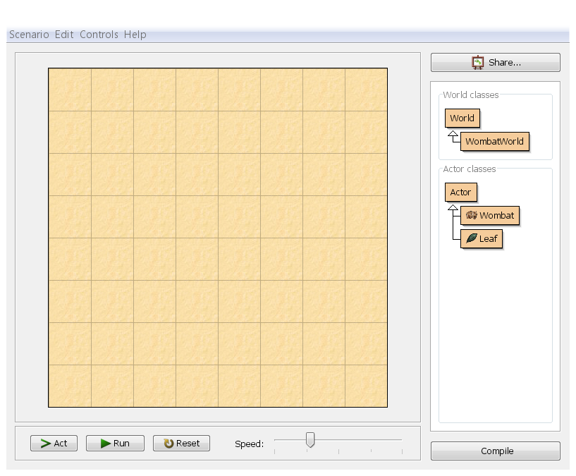


Se você não vir o mundo e as classes à direita estiverem com barras diagonais sobre elas, é porque o código não está compilado. Clique no botão "Compilar" no canto inferior direito.

A grande área da grade que cobre a maior parte da janela é chamada de _mundo_. Como temos um cenário aqui relacionado a wombates, vemos um mundo de wombates. À direita da janela está a classe display. Aqui você pode ver todas as classes Java envolvidas no projeto. As classes _World_ e _Ator_ estarão sempre lá — elas vêm com o sistema _Greenfoot_. As outras classes pertencem ao cenário de wombates e serão diferentes se você usar cenários diferentes.

Abaixo do mundo estão os Controles de Execução (a área com os botões _Act_, _Run_, _Reset_ e _Speed_ o controle deslizante).

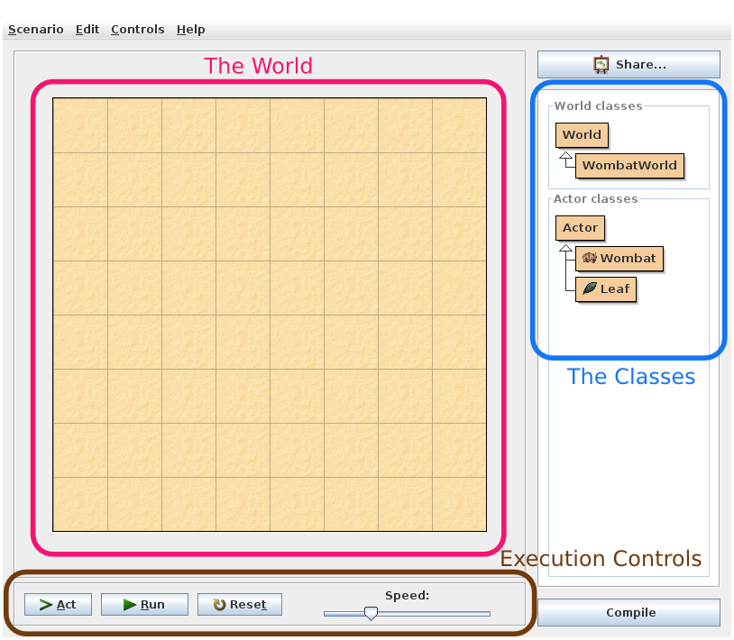


### Coloque objetos no mundo

Agora, vamos inserir alguns objetos no mundo. Clique com o botão direito do mouse na classe Wombat na exibição de classes. Você verá um menu pop-up como este:

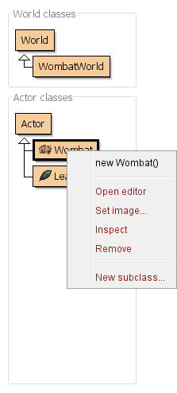

Escolha `new Wombat()` no menu. Em seguida, clique em qualquer lugar do mundo. Você acabou de criar um wombat (em termos Java: um objeto) e inseri-lo no mundo.

Wombats comem folhas, então vamos colocar algumas folhas no mundo também. Clique com o botão direito do mouse na classe `Leaf`, selecione `new Leaf()` e coloque a folha no mundo.

Existe um atalho para posicionar vários objetos um pouco mais rápido: <kbd>Shift</kbd>+clique no mundo. Certifique-se de que a classe `Leaf` esteja selecionada (clique com o botão esquerdo do mouse no painel de classes e ela ficará com uma borda preta mais grossa), então mantenha pressionada a tecla <kbd>Shift</kbd> e clique com o botão esquerdo do mouse no mundo várias vezes. Você posicionará um objeto da classe selecionada a cada clique. Muito mais rápido!

### Faça os objetos agirem

Clique no botão _Act_ nos controles de execução. Cada objeto agora age — ou seja: cada objeto faz o que foi programado para fazer. No nosso exemplo, as folhas são programadas para não fazer nada, enquanto os Wombates são programados para se moverem para frente. Tente colocar dois wombates no mundo e pressione _Act_ novamente. Ambos se moverão.

Os wombates também gostam de comer folhas. Se encontrarem uma folha no caminho, eles a comerão. Tente colocar algumas folhas na frente dos wombates e clique em _Act_ — os wombates se moverão para frente e comerão as folhas.

### Execute um cenário

Clique no botão _Run_. Isso equivale a clicar no botão _Act_ repetidamente, muito rapidamente. Você notará que o botão _Run_ muda para um botão _Pause_; clicar em _Pause_ interrompe toda a ação.

O controle deslizante ao lado dos botões _Act_ e _Run_ define a velocidade. Clique em _Run_ e altere o controle deslizante, e você verá a diferença.

### Invocar métodos diretamente

Em vez de simplesmente executar o cenário inteiro, você também pode invocar métodos individuais. Um método é uma ação única que um objeto pode executar.

Certifique-se de que haja um wombate no mundo e que o cenário não esteja em execução. Em seguida, clique com o botão direito do mouse no wombate (aquele no mundo, não na classe `Wombat`) e você verá que os objetos no mundo também têm um menu pop-up:

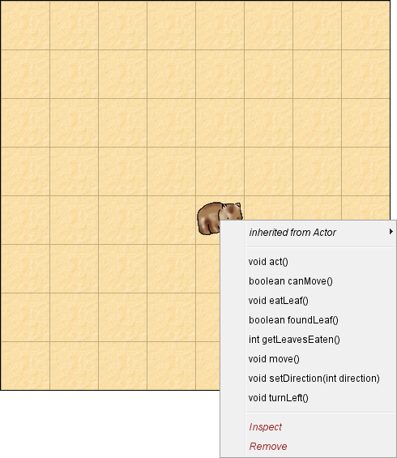

Você pode selecionar qualquer um dos métodos mostrados aqui para pedir ao vombate que faça algo. Experimente, por exemplo, turnLeft(). Selecionar isso no menu diz ao vombate para virar para a esquerda. Experimente também move().

Alguns métodos fornecem uma resposta. getLeavesEaten(), por exemplo, informará quantas folhas este vombate comeu até o momento. Experimente. Depois, faça o vombate comer outra folha e tente chamar esse método novamente.

Você também notará um método chamado `act()`. Este método é chamado sempre que você clica no botão "Agir". Se quiser que apenas um objeto atue em vez de todos os objetos do mundo, você pode fazer isso invocando o método `act()` do objeto diretamente.

### Crie um novo mundo

Se você tiver muitos objetos no mundo que não deseja mais e quiser começar tudo de novo, há uma opção fácil: descartar o mundo e criar um novo. Isso geralmente é feito clicando no botão "Redefinir" nos controles de execução. Você obterá um novo mundo vazio. O mundo antigo é descartado (e com ele todos os objetos que estavam nele) — você só pode ter um mundo ativo por vez.

### Invocar um método de World

Vimos que objetos no mundo possuem métodos que você pode invocar por meio de um menu pop-up. O mundo em si também é um objeto com métodos que você pode invocar. Clique com o botão direito do mouse em qualquer espaço vazio no mundo, ou na área cinza imediatamente ao lado do mundo, e você verá o menu do mundo:

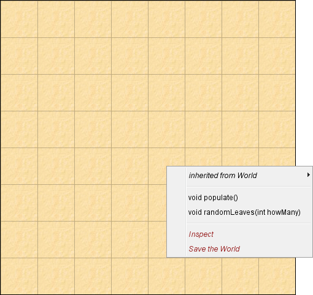

Um dos métodos neste menu é `populate()`. Experimente. É um método que cria várias folhas e wombates e os coloca no mundo. Você pode então executar o cenário.

Outro método de mundo é `randomLeaves(int howMany)`. Este método coloca algumas folhas no mundo em locais aleatórios. Observe que este método possui algumas palavras entre parênteses após seu nome: `int howMany`. Isso é chamado de _parâmetro_. Isso significa que você deve especificar alguma informação adicional ao invocar este método. O termo `int` indica que um número _inteiro_ é esperado, e o nome `howMany` sugere que você deve especificar quantas folhas deseja. Invoque este método. Uma caixa de diálogo será exibida, permitindo que você insira um valor para este parâmetro. Insira um número (por exemplo: 12) e clique em Ok.

(Você pode notar, se contar, que às vezes parece que menos folhas do que o número especificado foram criadas. Isso ocorre porque algumas folhas podem estar no mesmo local e sobrepostas.)

## Movimento e Controle de Teclas

Vamos fazer movimento no Greenfoot e como controlar atores com o teclado.

### O Cenário dos Caranguejos

Baixe o [arquivo zip](./files/modern-crab.zip) do cenário inicial do Crab e descompacte o conteúdo em algum lugar do seu disco rígido. Em seguida, abra o cenário nesse local no Greenfoot; você deverá ver a interface padrão do Greenfoot, com um mundo arenoso vazio:

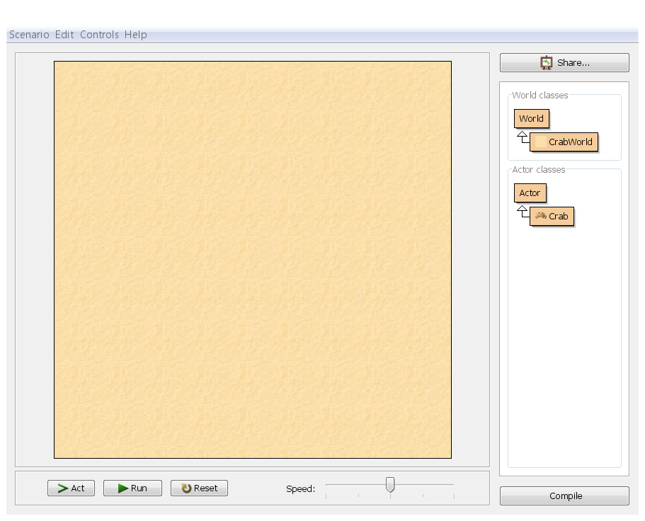


Clique com o botão direito na classe `Crab` e selecione `new Crab()`, depois clique com o botão esquerdo no mundo para posicionar o caranguejo:

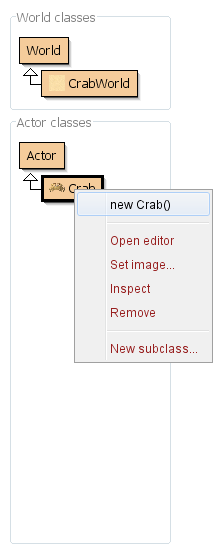

Depois disso, clique em Executar. Você pode estar torcendo para ver o Caranguejo dançar uma dança incrível pela tela. Infelizmente, parece que temos um Caranguejo preguiçoso! Vamos abrir o código e dar uma olhada; você pode clicar duas vezes na classe Caranguejo no navegador de classes ou clicar com o botão direito e selecionar "Abrir Editor":

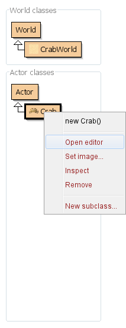

O que você verá é o código Java para o Crab. Você não precisa entender tudo ainda, mas a parte importante é o código entre as chaves abaixo da linha public void act() — não há nada lá:

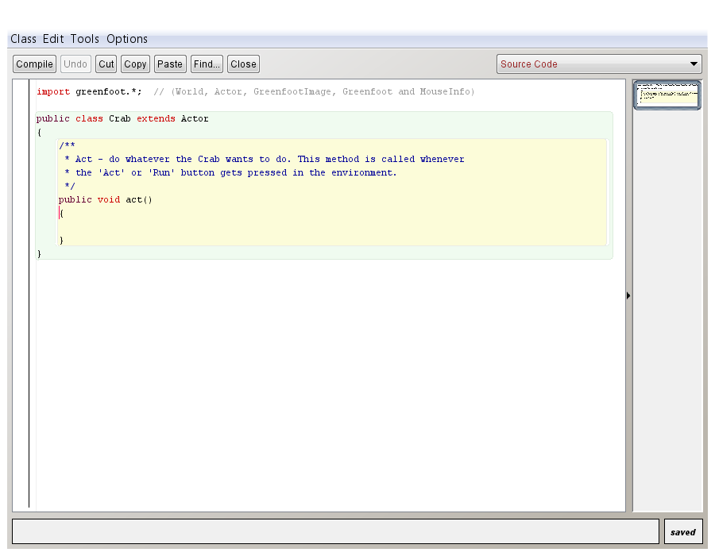

No código, você pode ver que não há nada entre as chaves. Se quisermos que nosso caranguejo faça alguma coisa, teremos que preencher isso. Vamos colocá-lo em movimento, adicionando uma instrução de movimento ao código:

```java
public void act(){
  move(4);
}
```

Você precisa corresponder exatamente ao que está escrito lá. É a palavra "move", seguida por parênteses curvos contendo o número 4, seguido por um ponto e vírgula. Erros comuns incluem colocar o "m" em maiúscula (letras maiúsculas importam em Java!), não usar o ponto e vírgula, usar os parênteses errados (ou pensar que parênteses curvos vazios são um zero) ou excluir acidentalmente as chaves. Se você receber um erro durante este tutorial, procure por um destes erros que você pode ter cometido ao copiar o código.

Depois de escrever isso, clique no botão Compilar na interface principal do Greenfoot (ou no topo da janela do editor), coloque um caranguejo no mundo novamente e clique em Executar. Agora, o caranguejo deve deslizar lateralmente pela tela. Em seguida, ele deve atingir a borda do mundo e parar abruptamente. Se desejar, você pode pausar o cenário, arrastar o caranguejo para a esquerda, clicar em Executar e assisti-lo novamente. Por que não colocar mais alguns caranguejos no mundo e vê-los fazer isso? Os caranguejos não estão realmente parando; eles ainda estão tentando se mover, mas o Greenfoot não os deixa sair do mundo (se deixassem, como você os arrastaria de volta?). Você pode variar a velocidade do Caranguejo alterando o número 4 no código para um número diferente. Quanto maior a velocidade, mais rápido, menor a velocidade — veja se consegue adivinhar o que acontece com um número negativo.

Vamos fazer o caranguejo fazer um pouco mais do que se mover em linha reta. Volte ao código e, após a linha de movimento, adicione outra linha (mas ainda dentro das chaves do método act) que diga `turn(3)`, assim:

```java
public void act(){
  move(4);
  turn(3);
}
```

Você verá que o caranguejo corre em círculos. Experimente girar o círculo para torná-lo mais estreito ou mais largo — deixaremos você decidir qual direção precisa e o porquê.

A vantagem de o caranguejo girar o tempo todo é que, mesmo que bata na borda do mundo, eventualmente ele girará o suficiente para se afastar da borda e voltar para o centro. Seria ainda melhor se pudéssemos controlar a rotação do caranguejo — vamos interagir um pouco no nosso cenário! Podemos fazer o caranguejo girar pressionando as teclas de cursor (seta) para a esquerda ou para a direita. Aqui está o código:

```java
public void act(){
  move(4);
  if (Greenfoot.isKeyDown("left")){
    turn(-3);
  }
  if (Greenfoot.isKeyDown("right")){
    turn(3);
  }
}
```

Usamos os métodos internos do Greenfoot para verificar se uma tecla está pressionada. Entre as aspas está o nome da tecla, "left" é a tecla do cursor para a esquerda, "right" é a tecla para a direita. Se você quiser algo como "a" e "d", basta usá-los! Nosso código está dizendo: se essas teclas estiverem pressionadas, gire um certo número de graus. Digite esse código, compile-o e experimente você mesmo. Você pode alterar a velocidade de rotação do caranguejo aumentando esses números.

Se você colocar vários caranguejos no mundo, verá que pressionar as teclas controla todos eles ao mesmo tempo em gloriosa sincronização, transformando você em uma espécie de senhor dos caranguejos: todos os caranguejos estão executando o mesmo código, então se você pressionar a tecla esquerda, todos eles verão que a tecla esquerda está pressionada e todos girarão de acordo.

O que acontece se você segurar os botões esquerdo e direito ao mesmo tempo? Experimente e descubra — depois, observe o código e tente descobrir o porquê.

## Detectando e Removendo Atores e Criando Métodos
Este tutorial explicará como descobrir se você está tocando em outro ator e, posteriormente, removê-lo do mundo. Também explicará como manter seu código legível usando métodos.

### Comendo minhocas

Já temos uma classe para o caranguejo — agora vamos adicionar outra para a minhoca. A minhoca também será um ator, então para criar a classe minhoca, clique com o botão direito (Mac: control-clique) na classe Ator e selecione "nova subclasse...":

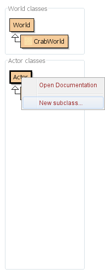

Como novo nome de classe, insira: `Worm` — observe que estamos usando W maiúsculo. É convenção em Java que comecemos os nomes de classe com letra maiúscula. Se você acidentalmente usar um w minúsculo agora, receberá um erro mais tarde ao copiar nosso código que usa W maiúsculo. Na lista de imagens à esquerda, selecione "worm.png" como imagem e clique em OK:

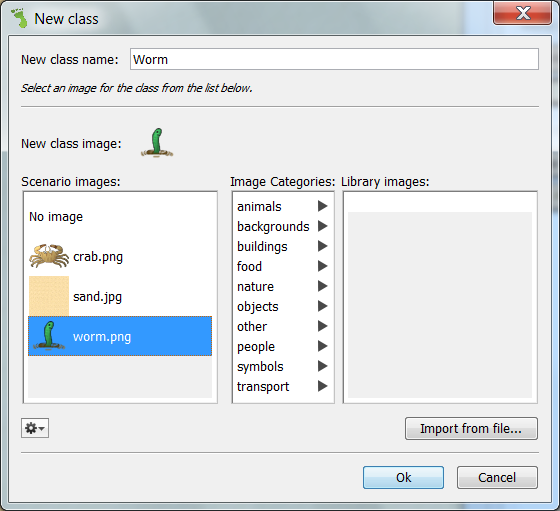

Nossa classe `Worm` não terá código real para começar — assim como nossa classe `Crab` tinha quando começamos. Vamos deixar assim; nossas minhocas são burras e ficam paradas no mesmo lugar, prontas para serem comidas. Presa fácil! Vamos modificar nossa classe `Crab` para que, quando nossos caranguejos passarem por cima de uma minhoca, eles a comam. Para fazer isso, voltamos ao código-fonte do nosso `Crab`, que atualmente se parece com isto:

```java
public void act(){
  move(4);
  if (Greenfoot.isKeyDown("left")){
    turn(-3);
  }
  if (Greenfoot.isKeyDown("right")){
    turn(3);
  }
}
```

No final do método `act()`, vamos inserir algum código para verificar se o caranguejo está tocando uma minhoca. Usaremos o método `isTouching`. Este método recebe um parâmetro. O  parâmetro nos permite indicar em qual classe estamos interessados; essa é a classe `Worm`:

```java
if(isTouching(Worm.class)){

}
```

Só podemos remover o `worm` quando houver um `worm`:

```java
    if (isTouching(Worm.class)) {
        removeTouching(Worm.class);
    }
```

Então, vamos fazer um teste. Compile, crie algumas minhocas e coloque-as no seu mundo, depois adicione um caranguejo, aperte _Run_ e use as teclas esquerda e direita para guiar o caranguejo até as minhocas, que devem ser comidas.

```java
public void act(){
  move(4);
  if (Greenfoot.isKeyDown("left")){
    turn(-3);
  }
  if (Greenfoot.isKeyDown("right")){
    turn(3);
  }
  if (isTouching(Worm.class)) {
      removeTouching(Worm.class);
  }
}
```


### Refatoração

Antes de prosseguirmos, faremos uma alteração no código. Isso é conhecido como refatoração: alterar o código sem alterar seu comportamento. Atualmente, o método `run()` para o Caranguejo possui dois comportamentos distintos: a metade superior lida com a movimentação e a metade inferior com a ingestão de minhocas. Seria mais claro nomeá-los e separá-los, para evitar confusões futuras. Podemos fazer isso criando métodos para cada comportamento. Na verdade, já vimos como os métodos são escritos: `act()` é um método, afinal.

Nossos dois novos métodos não exigem parâmetros e não retornam valor, então eles podem ser declarados da mesma forma que `act();` o código ajustado está abaixo:


```java
public void act(){
  moveAndTurn();
  eat();
}
public void moveAndTurn(){
  move(4);
  if (Greenfoot.isKeyDown("left")){
    turn(-3);
  }
  if (Greenfoot.isKeyDown("right")){
    turn(3);
  }
}
public void eat(){
  if (isTouching(Worm.class)) {
      removeTouching(Worm.class);
  }
}
```
Se você comparar este código com a versão anterior, notará que, na verdade, não alteramos nem removemos nada do código existente. Movemos a metade superior para um novo método chamado `moveAndTurn` e a metade inferior para um novo método chamado `eat`. Em seguida, substituímos o conteúdo do método `act()` por chamadas para esses novos métodos. Isso tornará o código no qual nos concentraremos mais curto.

### Mostrando o placar

Vamos colocar um contador no Caranguejo. Declare um `int quantidade` como atributo privado e inicialize ele com 0. Cada vez que o Caranguejo comer uma Warm esse numero deve ser incrementado e mostrado com o código abaixo:

```java
  //...
  private int quantidade = 0;
  //...
  getWorld().showText(String.valueOf(quantidade), 10, 10);
  //...

```

## Salvando o Mundo, Criando e Tocando Som

Como inicializar o mundo com atores, bem como reproduzir e gravar sons.

### Salvando o mundo

A esta altura, você provavelmente já está cansado de ter que adicionar novos objetos ao mundo toda vez que compilamos o código. É possível adicionar código para criar automaticamente algumas minhocas e um caranguejo para você — e, além disso, é possível fazer com que o Greenfoot escreva esse código para você! Clique em _Reset_ e adicione algumas minhocas e um caranguejo ao mundo. Antes de clicar em _Run_ , clique com o botão direito do mouse no mundo e selecione a opção "Save the World":

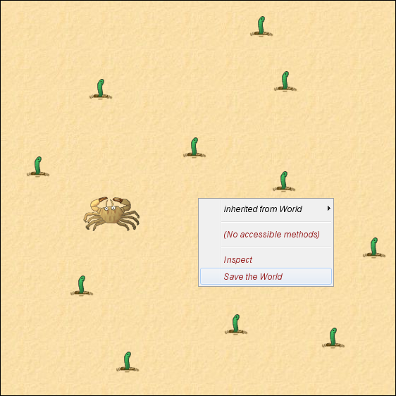

Isso adiciona algum código à nossa classe `CrabWorld`, que criará as minhocas e o caranguejo e os adicionará ao mundo na mesma posição na próxima vez que você reiniciar ou compilar. 

```java
    /**
     * Constructor for objects of class CrabWorld.
     * 
     */
    public CrabWorld()
    {    
        super(560, 560, 1); 
        prepare();
    }
    /**
     * Prepare the world for the start of the program.
     * That is: create the initial objects and add them to the world.
     */
    private void prepare()
    {
        addObject(new Crab(),169,151);
        addObject(new Worm(),114,331);
        addObject(new Worm(),252,269);
    } 
```

Procure no código-fonte da classe `CrabWorld`.

### Definindo o tamanho do mundo

Para alterar o tamanho do mundo, você precisa modificar o construtor da classe `CrabWorld`. A linha `super(560, 560, 1);` define o tamanho do mundo. O primeiro parâmetro é a largura, o segundo é a altura e o terceiro é o tamanho da célula em pixels.

### Tocando e gravando sons

Podemos adicionar algum som ao nosso cenário. O cenário vem com um som pronto para você usar, chamado "eating.wav". Podemos fazer esse som tocar sempre que o caranguejo comer uma minhoca adicionando uma única linha à nossa classe crab que chama `Greenfoot.playSound` após removermos uma minhoca do mundo:

```java
public void eat(){
  if (isTouching(Worm.class)) {
      removeTouching(Worm.class);
      Greenfoot.playSound("eating.wav");
  }  
}
```
Não se esqueça de ligar os alto-falantes (ou conectar os fones de ouvido). Uma última coisa: se você tiver um microfone no computador, pode gravar seus próprios sons. No menu Controles, há uma opção para exibir o gravador de som:

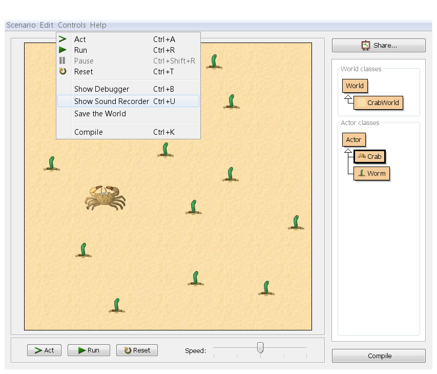

Selecione isso e você obterá o gravador de som:

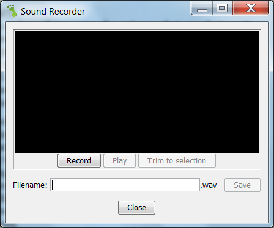

Pressione o botão de gravação e fale (ou amasse um pacote de comida vazio, ou algo assim!), depois pressione parar. Você deverá ver uma onda verde e, ao pressionar play, deverá ouvir o som sendo reproduzido. Caso contrário, há um problema com o seu microfone — tente pesquisar no Google para obter ajuda com isso. Supondo que haja algum som, quase invariavelmente haverá um pouco de silêncio no início e no fim do som — você pode ver isso no visor verde, pois ele terá uma linha horizontal plana no início e no fim, antes do formato:

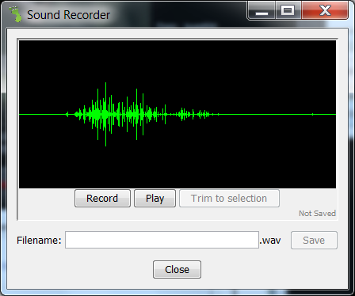

O silêncio no final não é um grande problema, mas o silêncio no início é irritante — significa que, quando você diz para o som tocar quando uma minhoca é comida, parece haver um pequeno atraso antes que o som comece a tocar, como se o jogo estivesse travando. Você pode limpar o silêncio selecionando a parte do meio (a parte que você deseja manter) clicando no início (após o silêncio inicial) e arrastando para o final (antes do silêncio final) — a seleção deve ser exibida em cinza. Em seguida, pressione "Cortar para seleção". O silêncio deve ser removido.

Salve o som digitando algo no campo de nome de arquivo (por exemplo, "myeating ") e clicando em Salvar. Feche o gravador de som e volte ao seu código. Encontre a linha com "eating.wav" e altere-a para "myeating.wav" (ou qualquer nome que você tenha usado, mais a extensão .wav). Assim, ao jogar, você deverá ouvir seu próprio som. Estamos quase terminando o jogo, mas precisamos adicionar um inimigo.

### Criando um jogo com 2 jogadores

Vamos colocar a Lagosta para disputar com o Caranguejo. 

Crie uma nova classe `Lobster` com o mesmo código fonte do `Crab`.

Para a movimentação o caranguejo utiliza as teclas da esquerda e da direita do teclado, na lagosta vamos mudar para <kbd>Q</kbd> e <kbd>W</kbd>.

```java
public void moveAndTurn(){
  move(4);
  if (Greenfoot.isKeyDown("q")){
    turn(-3);
  }
  if (Greenfoot.isKeyDown("w")){
    turn(3);
  }
}
```

Podemos agora adicionar uma Lagosta e ver quem consegue pegar mais minhocas.

### Usando Herança

Como o código de `Crab` e `Lobster` são muito parecidos, podemos reaproveitar boa parte do código. Isso é conhecido como herança. Vamos definir uma nova classe `Decapoda` que terá o que é comum a `Crab` e `Lobster`.


```java
public class Decapoda extends Actor
{
    private int quantidade = 0;
    private String keyLeft = "left";
    private String keyRight = "right";
    private int showTextX = 10;
    private int showTextY = 10;
    
    public Decapoda(String keyLeft, String keyRight, int showTextX , int showTextY ){
        this.keyLeft = keyLeft;
        this.keyRight = keyRight;
        this.showTextX = showTextX;
        this.showTextY = showTextY;
    }
    
    public void act(){
      moveAndTurn();
      eat();
    }
    public void moveAndTurn(){
      move(4);
      if (Greenfoot.isKeyDown(keyLeft)){
        turn(-3);
      }
      if (Greenfoot.isKeyDown(keyRight)){
        turn(3);
      }
    }
    public void eat(){

      if (isTouching(Worm.class)) {
        removeTouching(Worm.class);
        Greenfoot.playSound("eating.wav");
        quantidade++;
        getWorld().showText(String.valueOf(quantidade), showTextX, showTextY);
      }
    }       
}
```
Agora vamos definir `Crab` e `Lobster` como filhas de `Decapoda`


```java
public class Crab extends Decapoda
{
    public Crab(){
        super("left","right",10,10);
    }
    
}
```

```java
public class Lobster extends Decapoda
{
    public Lobster(){        
        super("q","w",550,550);        
    }    
}
```

no Greenfoot vai ficar assim:

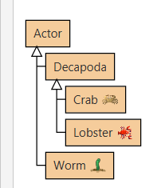

##  Adicionando um inimigo que se move aleatoriamente

Depois do nosso último tutorial, agora temos um cenário com um caranguejo que podemos controlar, que corre por aí comendo minhocas. O jogo é bem fácil — embora o caranguejo seja (deliberadamente) um pouco complicado de controlar, não há tensão. O que precisamos é de um inimigo que coma caranguejos: um **cavalo marinho**!
Para começar, vamos adicionar um **cavalo marinho** que se move em linha reta e come caranguejos. Podemos fazer isso usando um código que já vimos como escrever. Primeiro, adicionamos uma classe `Lobster` — lembre-se de que fazemos isso clicando com o botão direito do mouse na classe Actor e selecionando a nova subclasse. Você encontrará a imagem do **cavalo marinho** na lista de imagens à esquerda.

Depois de criar sua classe `Lobster`, você pode preenchê-la fazendo-o se mover em linha reta e comendo um caranguejo, se encontrar um. Você já viu como fazer cada uma dessas coisas em tutoriais anteriores, então não vou colar o código aqui diretamente. Tente você mesmo, mas se tiver dúvidas, pode ver a resposta aqui .


Você pode testar se o **cavalo marinho** está funcionando colocando um à esquerda de um caranguejo, clicando em "Executar" e deixando que ambos corram para o lado direito do mundo, onde o caranguejo será comido. (Se quiser, faça seu próprio som para quando o **cavalo marinho** comer o caranguejo.) Isso é ótimo, mas nosso **cavalo marinho** é bem burro; é fácil escapar dele movendo-se para o lado, e quando ele chega ao canto direito do mundo, ele fica lá para sempre (assim como nosso caranguejo original).

Vamos tornar nosso **cavalo marinho** mais difícil de evitar introduzindo um pouco de aleatoriedade. O Greenfoot fornece uma função Greenfoot.getRandomNumber que fornecerá um número aleatório. Aqui está uma primeira tentativa, onde giramos uma quantidade aleatória a cada quadro:

```java
public void moveAndTurn(){
  move(4);
  turn(Greenfoot.getRandomNumber(90));
}
```

Esse código significa que giraremos uma quantidade aleatória a cada quadro, entre 0 grau (inclusive) e 90 graus (exclusive). Experimente e veja como funciona. Você verá que isso não cria um inimigo muito ameaçador: a lagosta parece girar quase sempre no mesmo lugar (girando com muita frequência, na verdade) e sempre vira para a direita. Vamos corrigir esses problemas um por um, começando pelo giro no mesmo lugar.

No momento, nossa lagosta gira a cada quadro, o que a faz girar em vez de vagar. Há algumas maneiras diferentes de fazê-la girar com menos frequência. Uma seria ter uma variável de contador que registrasse quanto tempo se passou desde a última vez que giramos, e girasse, digamos, a cada 10 quadros. Outra maneira é usar o gerador de números aleatórios para girar aleatoriamente, com uma determinada média (por exemplo, a cada 10 quadros). Usaremos outro uso do gerador aleatório, pois ele torna a lagosta menos previsível.

Digamos que uma lagosta tenha 10% de chance de virar a cada quadro. Podemos codificar isso comparando Greenfoot.getRandomNumber(100) a uma determinada porcentagem:

```java
public void moveAndTurn(){
  move(4);
  if(Greenfoot.getRandomNumber(100) < 10){
    turn(Greenfoot.getRandomNumber(90));
  }
}
```

Se você estiver interessado, pense cuidadosamente sobre como isso funciona — por que usamos < em vez de <=? Poderíamos ter codificado de forma diferente, por exemplo, usando Greenfoot.getRandomNumber(50) ou Greenfoot.getRandomNumber(10)? E quanto a Greenfoot.getRandomNumber(5)?

Isso fará com que nossa lagosta vire (em média) a cada 10 quadros. Compile e execute, e veja o que acontece. A lagosta deve andar principalmente em linha reta, ocasionalmente virando à direita em uma distância variável. Isso é ótimo, e nos leva de volta ao nosso outro problema: a lagosta sempre vira à direita.

Sabemos, pelo nosso caranguejo, que a maneira de virar à esquerda é usar um número negativo para o ângulo. Se pudéssemos mudar a rotação da nossa lagosta de 0 a +90 para -45 a +45, isso resolveria o nosso problema. Existem algumas maneiras diferentes de fazer isso, mas aqui está a mais simples: observe que, se subtrairmos 45 do nosso número, obtemos um número na faixa correta. Então, vamos ajustar nosso código de acordo:


```java
public void moveAndTurn(){
  move(4);
  if(Greenfoot.getRandomNumber(100) < 10){
    turn(Greenfoot.getRandomNumber(90)-45);
  }
}
```

Nossa amplitude de giro está perfeitamente simétrica no momento? Se não, como você poderia corrigir isso?

Compile e execute isso, e teremos um predador relativamente eficaz que pode se voltar contra você a qualquer momento. Coloque um caranguejo, várias lagostas e muitas minhocas no mundo (e salve o mundo!) e tente comer todas as minhocas antes que as lagostas o peguem. Você pode notar, no entanto, que ainda há uma falha: as lagostas podem ficar presas por um tempo nas bordas do mundo. Isso ocorre porque, uma vez que atingem a borda do mundo, elas só se afastam depois de fazerem algumas curvas aleatórias.

Podemos acelerar o processo de retirada das lagostas das paredes novamente, fazendo-as girar 180 graus assim que chegarem à borda do mundo. Podemos verificar se elas estão na borda do mundo observando se a coordenada X delas está próxima de zero ou próxima da largura do mundo — e uma lógica semelhante para a coordenada Y (e a altura do mundo). O código está abaixo:


```java
public void moveAndTurn(){
  move(4);
  if(Greenfoot.getRandomNumber(100) < 10){
    turn(Greenfoot.getRandomNumber(90)-45);
  }
  if(getX() <=5 || getX() >= getWorld().getWidth() - 5){
    turn(180);
  }
  if(getY() <=5 || getY() >= getWorld().getHeight() - 5){
    turn(180);
  }
}
```


## Entrega

[Link 2A](https://classroom.github.com/a/Zk1nSKQl)
 
[Link 2B](https://classroom.github.com/a/2cbb8wuE)
