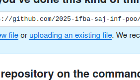

# Exercício: Modelagem Sistema Banco 

Execute o código abaixo para criar um sistema bancário simples utilizando conceitos de Orientação a Objetos, como classes, atributos, métodos e associações.

@[code](../code/listExemploBanco/Conta.java)

@[code](../code/listExemploBanco/Agencia.java)

@[code](../code/listExemploBanco/App.java)

após a execução, você deve realizar a entrega da tarefa (**print da execução**) no link abaixo:

[Entrega 2A](https://classroom.github.com/a/Se2V0BCJ)

[Entrega 2B](https://classroom.github.com/a/M5JXI-BD)

para a entrega do print, você pode utilizar você pode usar a ferramenta de captura de tela, salvar a imagem e enviar o arquivo no link acima.

clique na opção de *upload an existing file* e selecione o arquivo que você salvou.

